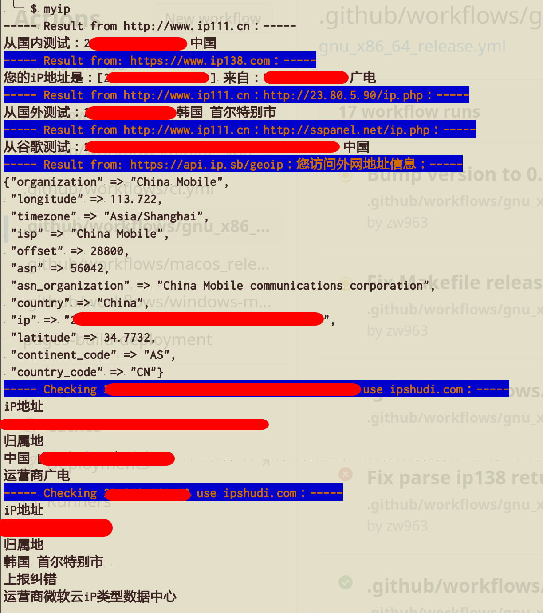

# myip

返回本机的公网 IP 以及访问外网的公网 IP，匿名使用以下服务（均无需 API key）：

- `myip ipify`：通过 `https://api.ipify.org` 获取 IPv4 地址
- `myip ipify6`：通过 `https://api6.ipify.org` 获取 IPv6 地址
- `myip cf`：通过 Cloudflare trace 获取 IP、机房、国家及连接信息
- `myip ident`：通过 ident.me 获取 IP 及地理信息（JSON）
- `myip aws`：通过 AWS CheckIP 获取 IP 地址
- `myip akamai`：通过 Akamai 获取 IP 地址
- `myip ipsb`：通过 `https://api.ip.sb/geoip` 获取详细 IP 信息
- `myip ifconfig`：通过 `https://ifconfig.io/ip` 获取 IP 地址
- `myip ip111`：通过 `https://ip111.cn` 获取国内、国外及 Google 路径的 IP 信息
- `myip ip138`：通过 `https://www.ip138.com` 获取国内 IP 信息

IPv6-only 服务需要当前网络具备可用的 IPv6 出口，否则会返回连接错误。

## Contributing

1. Fork it (<https://github.com/crystal-china/myip/fork>)
2. Create your feature branch (`git checkout -b my-new-feature`)
3. Commit your changes (`git commit -am 'Add some feature'`)
4. Push to the branch (`git push origin my-new-feature`)
5. Create a new Pull Request

## Contributors

- [Billy.Zheng](https://github.com/zw963) - creator and maintainer
