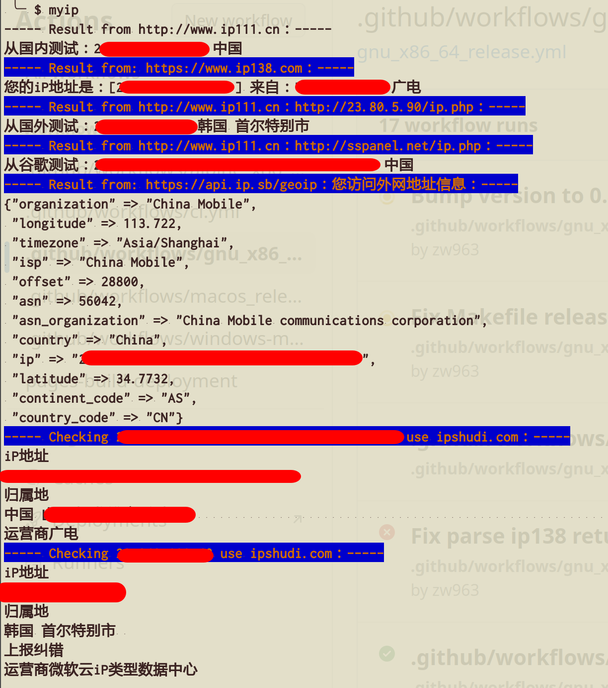

# myip

返回本机的公网 IP 以及访问外网的公网 IP，匿名使用以下服务:

http://www.ip111.cn/ 获取 IP 信息.
https://www.ipshudi.com 针对 ip111.cn 获取的 IP 信息,查询更加详细的信息.

此外,也额外访问以下网址获取信息作为补充

http://www.ip138.com 获取国内 IP 信息
https://api.ip.sb/geoip 获取外网的详细 IP 信息

## Contributing

1. Fork it (<https://github.com/crystal-china/myip/fork>)
2. Create your feature branch (`git checkout -b my-new-feature`)
3. Commit your changes (`git commit -am 'Add some feature'`)
4. Push to the branch (`git push origin my-new-feature`)
5. Create a new Pull Request

## Contributors

- [Billy.Zheng](https://github.com/zw963) - creator and maintainer
